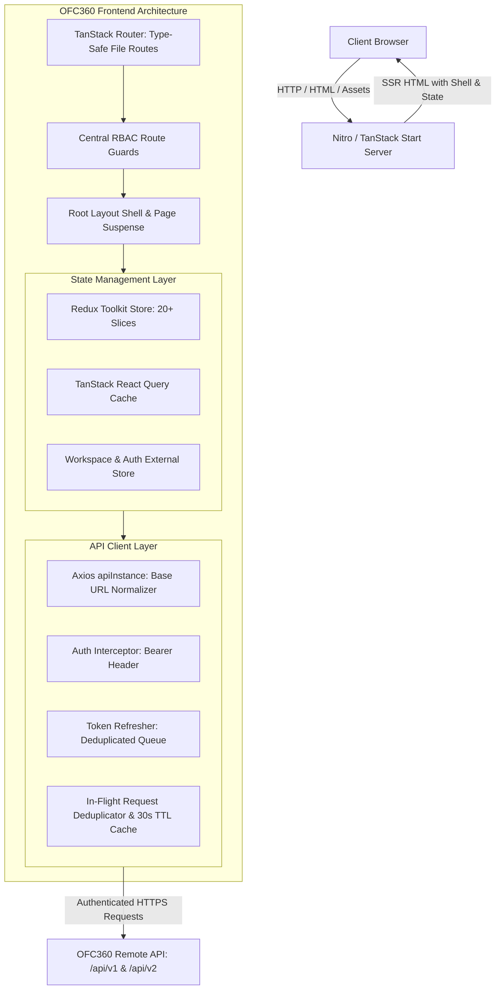
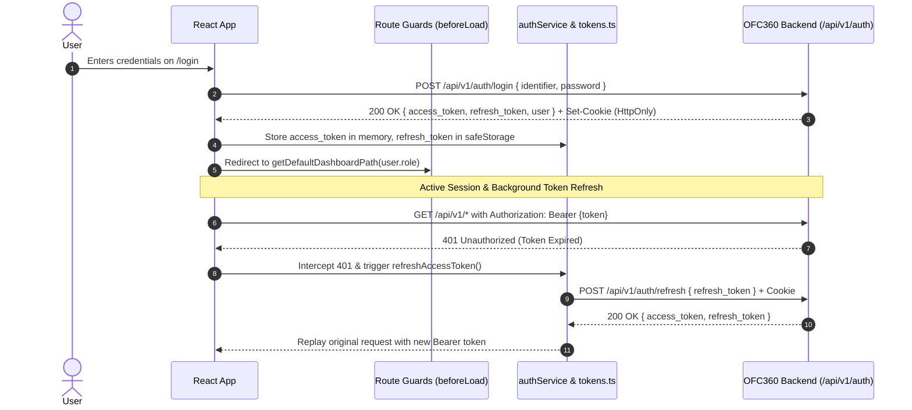
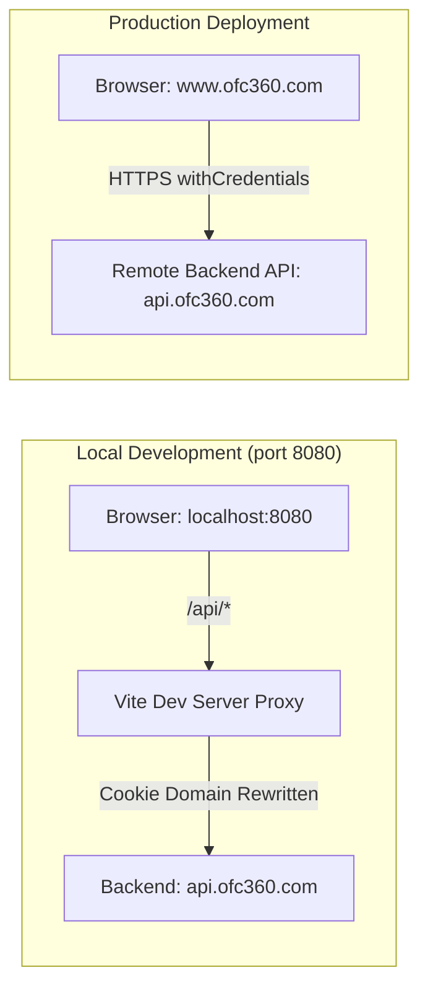

# OFC360 Frontend

An enterprise-grade Operations, Human Resource Management (HRMS), and Intelligence Platform built with modern web technologies: React 19, TanStack Start, Nitro, TanStack Router, Vite 8, Tailwind CSS v4, Redux Toolkit, and TanStack Query.

---

## 1. Project Overview

### What the Frontend Does
OFC360 Frontend is the single-page and server-rendered web application for the OFC360 platform. It provides an all-in-one digital operating system for modern enterprises, encompassing core HR operations, an end-to-end recruitment lifecycle (ATS), advanced multi-stage payroll governance, workforce attendance and shifts, employee self-service, IT asset tracking, document compliance, executive business intelligence, and AI-powered operational assistants.

### Purpose of OFC360
OFC360 bridges the gap between day-to-day HR workflows, financial compensation governance, and executive decision-making. By enforcing strict Role-Based Access Control (RBAC) and maker-checker segregation of duties, OFC360 provides organizations with audit-ready operational efficiency and real-time business insights.

### Target Users
* **Platform Super Administrators (`super_admin`)**: The sole platform owner responsible for managing tenant organizations, system configurations, cross-organization analytics, and global audit logs.
* **HR Administrators (`hr_admin`)**: Manages organization employees, departments, onboarding, leave policies, statutory settings, documents, and company-wide HR operations.
* **Talent Acquisition & Recruiters (`recruiter`, `hr_admin`)**: Manages job requisitions, candidate sourcing, talent pools, AI resume screening, interview scheduling, scorecards, and offer generation.
* **Team Managers (`manager`)**: Manages team attendance, approves leave and shift requests, oversees team performance reviews, and coordinates hiring requisitions.
* **Employees (`employee`)**: Uses self-service portals to clock attendance, view shifts, request time off, view and download monthly payslips, access assigned assets, and review internal documents.
* **IT Administrators (`it_admin`)**: Oversees hardware/software assets, track asset assignments, monitors integrations, and inspects technical audit logs.
* **C-Suite Executives (`executive`)**: Role-tailored dashboards for CEO, CTO, CIO, CFO, COO, and CMO displaying strategic telemetry, headcounts, burn rates, engineering metrics, cloud networks, and compliance health.

### Main Capabilities Actually Implemented
* **Multi-Tenant Administration**: Complete organization onboarding, user administration, status control (active, suspended, trial), and global platform activity logging.
* **Recruitment & ATS Suite**: 40 specialized screens covering job creation, candidate pipelines, resume parsing, candidate CRM, automated interview simulator, and public job application portals.
* **Comprehensive Payroll Engine**: Full lifecycle processing across payroll periods, automated calculation runs, rule validation, preview checks, maker-checker governance approvals, cryptographic locking, payment batch generation, and full & final (F&F) settlements.
* **Time & Attendance**: Web-based check-in/check-out, holiday calendar management, work shift definitions, and department roster scheduling.
* **Leave Management**: Leave requests, multi-level manager approvals, balance tracking, and AI-driven absence pattern analysis.
* **AI & Intelligence Hub**: Real-time AI modules including Recruiter AI, Performance Coach, Leave Assistant, Meeting Intelligence, Policy Assistant, Compliance Monitor, and Workforce Planning.
* **Documents & Assets Hub**: Secure file uploads, categorical organization, document verification workflows, and IT asset assignment tracking.
* **Public Web Experience**: Fully featured marketing site including Home, About, Features, Pricing, Blog with dynamic slugs, FAQ, and Contact pages.

---

## 2. Tech Stack

The technologies and exact version ranges configured in the repository:

### Core Framework & Runtime
| Technology | Package / Specification | Version | Purpose |
| :--- | :--- | :--- | :--- |
| **Framework** | `@tanstack/react-start` | `^1.167.50` | Full-stack React framework with SSR and streaming |
| **Server Engine** | `nitro` | `3.0.260603-beta` | Universal deployment engine and server runtime |
| **Build Tool** | `vite` | `^8.0.16` | Next-generation frontend bundler and dev server |
| **UI Library** | `react`, `react-dom` | `^19.2.0` | React 19 concurrent runtime and component model |
| **Language** | `typescript` | `^5.8.3` | Strict static typing and code safety |

### Styling & UI Design System
| Technology | Package | Version | Purpose |
| :--- | :--- | :--- | :--- |
| **CSS Engine** | `tailwindcss`, `@tailwindcss/vite` | `^4.2.1` | Tailwind CSS v4 with `@theme inline` & OKLCH color spaces |
| **Animation** | `framer-motion`, `tw-animate-css` | `^12.40.0`, `^1.3.4` | Fluid UI transitions and micro-interactions |
| **Icons** | `lucide-react` | `^0.575.0` | Modern, consistent iconography |
| **UI Primitives** | `@radix-ui/react-*` | Latest (v1–v2) | Accessible unstyled primitives (Dialog, Dropdown, Tabs, etc.) |
| **Toast System** | `sonner` | `^2.0.7` | Rich notification toasts with action support |
| **Bottom Drawers**| `vaul` | `^1.1.2` | Mobile-friendly swipeable drawer component |
| **Carousel** | `embla-carousel-react` | `^8.6.0` | Lightweight touch-enabled carousel |
| **Command Palette**| `cmdk` | `^1.1.1` | Fast modal search and command palette |
| **Date Pickers** | `react-day-picker`, `date-fns` | `^9.14.0`, `^4.1.0` | Calendar controls and robust date manipulation |
| **OTP Input** | `input-otp` | `^1.4.2` | Accessible one-time passcode inputs |
| **Panels** | `react-resizable-panels` | `^4.6.5` | Resizable multi-column workspace layouts |

### State Management & Data Fetching
| Technology | Package | Version | Purpose |
| :--- | :--- | :--- | :--- |
| **Routing** | `@tanstack/react-router` | `^1.168.25` | Type-safe client/server routing with code generation |
| **Router Plugin** | `@tanstack/router-plugin` | `^1.167.28` | Vite plugin for automatic route tree generation |
| **Server State** | `@tanstack/react-query` | `^5.83.0` | Async query caching, invalidation, and background sync |
| **Global State** | `@reduxjs/toolkit`, `react-redux` | `^2.12.0`, `^9.3.0` | Centralized feature slices and asynchronous thunks |
| **API Client** | `axios` | `^1.18.1` | HTTP client with retry interceptors and token refresh |
| **External Store**| `useSyncExternalStore` | React 19 Core | Reactive workspace and session persistence store |

### Forms, Validation & Utilities
| Technology | Package | Version | Purpose |
| :--- | :--- | :--- | :--- |
| **Forms** | `react-hook-form` | `^7.71.2` | High-performance declarative form management |
| **Validation** | `zod`, `@hookform/resolvers` | `^3.24.2`, `^5.2.2` | Schema-driven runtime validation |
| **Charts** | `recharts` | `^2.15.4` | SVG-based responsive data visualization charts |
| **AI SDK** | `ai`, `@ai-sdk/react`, `@ai-sdk/openai-compatible` | `^6.0.208`, `^3.0.210`, `^2.0.51` | Streaming LLM integration and chat interfaces |
| **Markdown** | `react-markdown` | `^10.1.0` | Render structured AI outputs and policy documents |
| **CSV & QR** | `papaparse`, `qrcode` | `^5.5.4`, `^1.5.4` | CSV data parsing/exporting and QR code generation |

### Quality & Testing
| Technology | Package | Version | Purpose |
| :--- | :--- | :--- | :--- |
| **Test Runner** | `vitest` | `^5.0.1` | Fast Vite-native unit and integration test runner |
| **DOM Testing** | `@testing-library/react`, `jsdom` | `^16.3.3`, `^29.1.1` | Component testing in browser DOM simulation |
| **Mocking** | `msw` | `^2.15.0` | Mock Service Worker for network isolation |
| **Coverage** | `@vitest/coverage-v8` | `^5.0.1` | V8 native test coverage reporting |
| **Linter** | `eslint`, `typescript-eslint` | `^9.32.0`, `^8.56.1` | ESLint 9 flat configuration with type awareness |
| **Code Style** | `prettier`, `eslint-plugin-prettier` | `^3.7.3`, `^5.2.6` | Opinionated code formatting |

---

## 3. Architecture

OFC360 Frontend follows a hybrid Server-Side Rendered (SSR) and Client-Side Rendered (SPA) architecture enabled by **TanStack Start**, **Nitro**, and **TanStack Router**.



### Architectural Tenets
1. **Thin Route Wiring vs. Feature Pages**:
   * `src/routes/`: Route definitions remain lightweight (~15 lines), handling path parameters, metadata tags, and lazy component imports via `lazyFeaturePage`.
   * `src/features/`: Feature modules house the UI components, business logic, React hooks, Redux slices, and type definitions.
2. **Deterministic Route Guards**:
   * Defined centrally in `src/lib/route-guards.ts`. Every route navigation evaluates the user's canonical role before rendering. Non-permitted paths redirect immediately to the user's default dashboard or `/dashboard/forbidden`.
3. **Four-Tiered State Architecture**:
   * **Server Cache**: TanStack React Query (`QueryClient` in `src/router.tsx`) caches asynchronous server records with a 1-minute `staleTime`, 5-minute `gcTime`, and disabled window-focus refetches.
   * **In-Flight & HTTP Cache**: `src/api/apiInstance.ts` provides promise deduplication for concurrent GET requests and a 30-second in-memory TTL cache, instantly invalidated upon any mutating request (`POST`, `PUT`, `PATCH`, `DELETE`).
   * **Domain State**: Redux Toolkit slices (`src/redux/store.ts`) manage multi-step forms, complex wizard state, filter parameters, and AI interactions.
   * **Session & Workspace State**: Synchronized external store holding the active user profile, tenant organization metadata, and authentication restoration status.
4. **Resilient Chunk & Asset Recovery**:
   * Handles modern deployment transitions gracefully via `src/lib/chunk-reload.ts`. If an old client session encounters a missing chunk after a new deployment, the error boundary automatically intercepts the error and reloads the application cleanly.

---

## 4. Project Structure

The actual project structure of the OFC360 frontend repository:

```text
├── .github/
│   └── workflows/
│       └── ci.yml               # GitHub Actions CI workflow (lint, typecheck, test, build)
├── public/                      # Static public assets, icons, and favicons
├── scripts/
│   ├── count-any.ps1            # PowerShell script enforcing strict TypeScript 'any' ratchet
│   ├── count-any.sh             # Bash script enforcing strict TypeScript 'any' ratchet
│   └── generate-favicon.cjs     # Node utility for generating multi-size favicons
├── src/
│   ├── api/                     # Central HTTP clients, auth tokens, interceptors, and endpoints
│   │   ├── apiInstance.ts       # Axios instance, token refresh queue, in-memory TTL cache
│   │   ├── auth.ts              # Authentication service (login, register, reset, me)
│   │   ├── client.ts            # Normalized API client methods and ApiError class
│   │   ├── endpoints.ts         # Canonical /api/v1/auth/* endpoint definitions
│   │   ├── tokens.ts            # In-memory access token & persistent refresh token manager
│   │   └── types.ts             # Base API response types and user payload interfaces
│   ├── components/
│   │   ├── common/              # Global components (BackButton, CountrySelect, PageSkeleton, TimezoneSelect)
│   │   ├── hrms/                # Shared enterprise HRMS UI widgets
│   │   ├── icons/               # Specialized SVG icon assets
│   │   ├── site/                # Public marketing layout (Navbar, Footer, CTA, FAQ, ThemeProvider)
│   │   └── ui/                  # 47 atomic Shadcn/Radix components (Button, Dialog, Table, etc.)
│   ├── features/                # Domain-driven feature modules
│   │   ├── admin/               # Administrative operations (departments, employees, managers, recruitment)
│   │   ├── attendance/          # Time & attendance (CheckIn, Holidays, Rosters, Shifts)
│   │   ├── auth/                # Authentication UI components and forms
│   │   ├── ceo/, cio/, cto/     # Specialized C-suite executive dashboard modules
│   │   ├── dashboard/           # Executive command center dashboard
│   │   ├── documents/           # Document management, dialogs, and verification hooks
│   │   ├── employee-onboarding/ # Multi-step enterprise employee onboarding wizard
│   │   ├── executive/           # Executive metrics, charts, and intelligence feeds
│   │   ├── notifications/       # Notification list, drawer, and optimistic rollback hooks
│   │   ├── payroll/             # Advanced payroll features (runs, batches, F&F, statutory, ESS)
│   │   ├── portal/              # Role-specific portals (Employee self-service, Manager dashboard)
│   │   ├── settings/            # Comprehensive settings (company, general, tax, overtime, security)
│   │   └── superAdmin/          # Platform owner command center (analytics, audit, orgs, users)
│   ├── hooks/                   # Shared utility hooks (useDebounce, useConfirmDialog, use-mobile)
│   ├── lib/                     # Core system utilities, RBAC guards, and helper logic
│   │   ├── auth-bootstrap.ts    # Session bootstrap, cookie refresh, and auth readiness synchronization
│   │   ├── chunk-reload.ts      # Deployment chunk failure recovery listeners
│   │   ├── config.server.ts     # Server-only configuration utilities
│   │   ├── permissions.ts       # Platform and company permission mapping constants
│   │   ├── publicUrl.ts         # Public domain resolver for career site & job apply links
│   │   ├── role-paths.ts        # Canonical default path resolvers per role
│   │   ├── role-routing.ts      # Role-safe redirect URLs and login redirect handlers
│   │   ├── roles.ts             # Canonical role definitions (ALL_APP_ROLES, normalizeRole)
│   │   ├── route-guards.ts      # Central route authorization matrix and access checker
│   │   └── safe-storage.ts      # SSR-safe localStorage and sessionStorage wrapper
│   ├── pages/                   # Standalone and shared pages (Exit Management, Assets, Attendance, etc.)
│   ├── redux/                   # Redux Toolkit store, root reducer, RTK Query API, and hooks
│   ├── routes/                  # TanStack Router file-based route tree
│   │   ├── __root.tsx           # Application root layout with providers, error boundaries, and meta tags
│   │   ├── index.tsx            # Public landing page
│   │   ├── login.tsx            # Sign-in route
│   │   ├── register.tsx         # Tenant registration route
│   │   ├── dashboard.tsx        # Dashboard layout shell and sub-route outlet
│   │   └── dashboard/           # Nested dashboard routes (recruitment, payroll, super-admin, etc.)
│   ├── services/                # Pure typed API services (attendanceApi, payrollApi, aiHub.api, etc.)
│   ├── store/                   # Specialized Redux slices and selectors (aiHub, compliance, recruiter)
│   ├── test/                    # Global test setup, mocks, and smoke tests
│   ├── routeTree.gen.ts         # Auto-generated TanStack Router route tree (do not edit manually)
│   ├── router.tsx               # Router initialization and QueryClient configuration
│   ├── server.ts                # Server entry point for Nitro SSR handling
│   ├── start.ts                 # TanStack Start server middleware and error handler
│   └── styles.css               # Tailwind CSS v4 root stylesheet and theme tokens
├── .any-baseline                # Strict TypeScript ratchet baseline
├── .env                         # Development environment variables
├── .env.production              # Production environment variables
├── eslint.config.js             # ESLint 9 flat configuration
├── package.json                 # Project dependencies, scripts, and engine specifications
├── tsconfig.json                # TypeScript compiler configuration
├── vercel.json                  # Vercel deployment and caching header configuration
├── vite.config.ts               # Vite configuration (plugins, dev proxy, manual chunks)
└── vitest.config.ts             # Vitest test runner configuration
```

---

## 5. Application Modules

### 1. Dashboard & Executive Command Center
* **Purpose**: Provides role-specific overview metrics, critical operational alerts, and high-level telemetry.
* **Main Routes**:
  * `/dashboard` — Main operational dashboard (HR Admin & Executive).
  * `/dashboard/super-admin` — Platform owner overview.
  * `/dashboard/manager` — Team manager operational cockpit.
  * `/dashboard/employee` — Employee self-service dashboard.
  * `/dashboard/executive` (and sub-dashboards: `/ceo`, `/cto`, `/cio`, `/cfo`, `/coo`, `/cmo`).
* **Key Functionality**: Real-time headcount metrics, active payroll run status, attendance trends, quick actions, and executive business KPIs.
* **Access**: Role-dependent (`super_admin`, `hr_admin`, `manager`, `employee`, `executive`).

### 2. Workforce & Organization Management
* **Purpose**: Centralized administration of human capital, organizational hierarchy, and departmental structures.
* **Main Routes**:
  * `/dashboard/employees` — Comprehensive employee directory with status filtering.
  * `/dashboard/departments` — Departmental hierarchy, budgets, and lead assignments.
  * `/dashboard/managers` — Manager assignments and team spans of control.
  * `/dashboard/hierarchy` — Interactive organizational tree / graph view.
  * `/dashboard/people` — Unified people hub.
* **Backend Dependencies**: `GET /api/v1/employees`, `GET /api/v1/departments`, `GET /api/v1/organization/graph`.
* **Access**: `hr_admin`, `manager` (team views only).

### 3. Recruitment & Applicant Tracking System (ATS)
* **Purpose**: Full-lifecycle recruitment platform managing talent acquisition from requisition to offer.
* **Main Routes (40 specialized screens)**:
  * `/dashboard/recruitment` — ATS command center.
  * `/dashboard/recruitment/jobs` & `/jobs/new` — Requisition drafting, salary ranges, and job requirements.
  * `/dashboard/recruitment/jobs/$jobId` & `/publish` — Job details and career site publishing.
  * `/dashboard/recruitment/candidates` & `/$candidateId` — Candidate profiles, resumes, and timelines.
  * `/dashboard/recruitment/pipeline` — Visual Kanban board tracking candidate stages.
  * `/dashboard/recruitment/ai-screening` — AI-powered resume matching and skill extraction.
  * `/dashboard/recruitment/ai-interview` — Automated interview simulator and evaluation builder.
  * `/dashboard/recruitment/scorecards` — Standardized candidate evaluation rubrics.
  * `/dashboard/recruitment/offers` & `/compensation` — Compensation offer builder with automated offer letters.
  * `/dashboard/recruitment/preboarding` & `/employee-onboarding` — Post-offer candidate onboarding.
  * `/dashboard/recruitment/career-site` — Organization public career portal settings.
* **Public Route**: `/jobs/apply/$ukey` — Public, unauthenticated candidate job application page.
* **Backend Dependencies**: `recruitmentApi`, `screeningApi`, `recruiterApi`.
* **Access**: `hr_admin`, `recruiter`, and `manager` (limited to requisitions and assigned interviews).

### 4. Payroll & Compensation
* **Purpose**: Multi-stage financial compensation processing engine enforcing strict compliance and audit controls.
* **Main Routes**:
  * `/dashboard/payroll` — Main payroll dashboard with overview metrics.
  * `/dashboard/payroll/periods` — Pay cycle creation and tracking.
  * `/dashboard/payroll/runs/$runId/processing` — Calculation execution engine.
  * `/dashboard/payroll/runs/$runId/validation` — Pre-approval data validation and compliance flags.
  * `/dashboard/payroll/runs/$runId/preview` — Detailed gross-to-net computation preview.
  * `/dashboard/payroll/runs/$runId/approval` — Maker-checker governance approval.
  * `/dashboard/payroll/runs/$runId/finalize` — Cryptographic run locking.
  * `/dashboard/payroll/runs/$runId/payment` & `/payments` — Bank disbursement batch generation.
  * `/dashboard/payroll/payslips` — Payslip hub and bulk distribution.
  * `/dashboard/payroll/full-and-final` — Separation settlement calculations.
  * `/dashboard/payroll/salary-structure` — Component-based salary formulas (CTC, allowances, deductions).
  * `/dashboard/payroll/variable-inputs` — Monthly overtime, bonuses, and deductions.
  * `/dashboard/payroll/statutory` — Tax slabs, PF, ESI, and statutory limits.
  * `/dashboard/payroll/reports` — Double-entry accounting journals and payroll registers.
* **Self-Service Route**: `/dashboard/employee/payroll` — Personal payslip history and tax declarations.
* **Backend Dependencies**: `payrollApi` (`/api/v1/payroll/*` and `/api/v2/payroll/*`).
* **Access**: `hr_admin` exclusively for run/batch management; `employee` for self-service payslips.

### 5. Attendance & Time Tracking
* **Purpose**: Time tracking, clock-in governance, shift management, and holiday configuration.
* **Main Routes**:
  * `/dashboard/attendance` — Organization attendance monitoring.
  * `/dashboard/attendance/checkin` — Web-based employee clock-in/clock-out interface.
  * `/dashboard/attendance/shifts` — Shift rules, grace periods, and break policies.
  * `/dashboard/attendance/rosters` — Department-level employee scheduling.
  * `/dashboard/attendance/holidays` — Mandatory and optional company holiday calendars.
  * `/dashboard/timesheets` — Daily and weekly work hour summaries.
* **Backend Dependencies**: `attendanceApi.ts` (`/api/v1/attendance/*`).
* **Access**: `hr_admin`, `manager`, `employee` (check-in and personal view).

### 6. Leave Management
* **Purpose**: Employee leave requests, quota tracking, and multi-level manager approvals.
* **Main Routes**:
  * `/dashboard/leaves` — Leave application dashboard and approval requests.
  * `/dashboard/workforce/leaves` — Workforce absence calendar and holiday schedules.
* **Backend Dependencies**: `attendanceApi.ts` leave endpoints and `leaveAssistantApi.ts`.
* **Access**: `hr_admin`, `manager`, `employee`.

### 7. AI & Intelligence Hub
* **Purpose**: Suite of integrated AI agents enhancing productivity and analyzing workforce trends.
* **Main Routes**:
  * `/ai` & `/dashboard/ai-hub` — AI Hub overview and agent activity monitoring.
  * `/ai/analytics-center` — Conversational natural language analytics over workforce data.
  * `/ai/attendance-monitor` — Pattern anomaly detection in employee clock-ins.
  * `/ai/compliance-monitor` — Automated labor law compliance checklist audits.
  * `/ai/document-generator` — Context-aware HR document generation (offer letters, NDAs, warnings).
  * `/ai/employee-health` — Anonymized burnout and organizational sentiment analysis.
  * `/ai/leave-assistant` — Leave policy Q&A and seasonal absence forecasting.
  * `/ai/meeting-intelligence` — Action item extraction and meeting summarization.
  * `/ai/performance-coach` — Suggested employee goals, milestones, and 360-degree review questions.
  * `/ai/policy-assistant` — Instant semantic answers from company handbook documents.
  * `/ai/recruiter` — Automated candidate scoring and job description generation.
  * `/ai/workforce-planning` — Future headcount growth forecasting based on business plans.
  * `/dashboard/ai-hub/assistant` — Interactive conversational operational assistant.
* **Backend Dependencies**: `src/services/aiHub.api.ts` and `src/routes/api/ai-brain.ts`.
* **Access**: `hr_admin`, `executive`, `manager` (module-dependent).

### 8. Assets & IT Management
* **Purpose**: Tracking physical hardware and digital licenses assigned across the organization.
* **Main Routes**:
  * `/dashboard/assets` & `/dashboard/asset-management` — Hardware/software inventory, asset allocation, return condition tracking, and depreciation.
  * `/dashboard/it-admin` — IT access controls, credential lifecycle, and hardware provisioning.
* **Access**: `it_admin`, `hr_admin`, and `employee` (viewing assigned assets).

### 9. Documents Management
* **Purpose**: Digital repository for company policies and employee personal documents.
* **Main Routes**:
  * `/dashboard/documents` & `/dashboard/resources/documents` — Organization documents classified by category (Employee, Education, Employment, Company).
  * `/dashboard/employee` (My Documents) — Employee personal document upload and verification status.
* **Backend Dependencies**: `myDocumentsApi.ts` and `src/features/documents`.
* **Access**: `hr_admin`, `manager`, `employee` (personal files only).

### 10. Platform Administration & Settings
* **Purpose**: System-wide configuration, tenant branding, security enforcement, and integration management.
* **Main Routes**:
  * `/dashboard/super-admin/organizations` — Tenant company listing, creation, and subscription status.
  * `/dashboard/super-admin/users` — Cross-tenant user directory and credential management.
  * `/dashboard/super-admin/platform-config` — Maintenance mode, rate limits, and registration toggles.
  * `/dashboard/super-admin/audit-logs` — Global administrative security audit events.
  * `/dashboard/settings/company` — Tenant company branding, logos, seals, address, and timezone.
  * `/dashboard/settings/security` — Password policy, session timeouts, and two-factor authentication.
  * `/dashboard/settings/notifications` — Email and in-app event notification routing.
  * `/dashboard/settings/roles-permissions` — Granular role-to-permission mapping.
* **Access**: `super_admin` (platform area); `hr_admin` (tenant settings); `it_admin` (audit logs).

---

## 6. User Roles & Permissions

OFC360 implements a strict, verified Role-Based Access Control (RBAC) architecture (`src/lib/roles.ts` and `src/lib/permissions.ts`).

### Canonical Roles
The system defines 7 canonical application roles:

| Role Identifier | Display Label | Scope | Primary Responsibility | Default Landing Path |
| :--- | :--- | :--- | :--- | :--- |
| `super_admin` | Super Admin | Platform Owner | Multi-tenant control, platform configuration, global audit logs | `/dashboard/super-admin` |
| `hr_admin` | HR Admin | Organization | Full HR operations, payroll execution, employee directory, company settings | `/dashboard` |
| `executive` | Executive | Organization | C-suite business telemetry, strategic reports, and executive dashboards | `/dashboard/executive` |
| `manager` | Manager | Team / Dept | Team attendance, leave review, performance evaluations, hiring approvals | `/dashboard/manager` |
| `employee` | Employee | Self-Service | Personal profile, web clock-in/out, leave applications, payslip downloads | `/dashboard/employee` |
| `it_admin` | IT Admin | Technical | Technical assets, system access, integration settings, system audit logs | `/dashboard/admin` |
| `recruiter` | Recruiter | Talent | Requisitions, candidate pipeline, interviews, scorecards, job offers | `/dashboard/recruitment` |

### Architectural Boundary: Platform Owner vs. Company Roles
* **Strict Separation**: `super_admin` is the sole **Platform Owner**. The platform owner is completely separated from tenant company operational workflows (such as running daily payroll or managing department shifts).
* **Tenant Isolation**: Non-super_admin roles attempting to access `/dashboard/super-admin/*` are rejected immediately by route guards with a redirection to `/dashboard/forbidden`.
* **Platform Owner Isolation**: If a `super_admin` attempts to access company operational workflows (`/dashboard/payroll`, `/dashboard/employee`, `/dashboard/recruitment`), route guards automatically redirect them to `/dashboard/super-admin`.

### Route Authorization Matrix
Verified route access mapping from `src/lib/route-guards.ts`:

| Route Prefix | Permitted Roles | Behavior on Unauthorized Access |
| :--- | :--- | :--- |
| `/dashboard/super-admin/*` | `super_admin` ONLY | Redirect to `/dashboard/forbidden` |
| `/dashboard/executive/*` | `executive`, `hr_admin` (CIO sub-route permits `it_admin`) | Redirect to user's default dashboard |
| `/dashboard/analytics` | `hr_admin`, `executive`, `manager` | Redirect to user's default dashboard |
| `/dashboard/recruitment/*` | `recruiter`, `hr_admin` (Hiring manager routes permit `manager`) | Redirect to user's default dashboard |
| `/dashboard/payroll/*` | `hr_admin` (`payslips` sub-route permits `employee` & `manager`) | Redirect to user's default dashboard |
| `/dashboard/employees` | `hr_admin`, `manager` | Redirect to user's default dashboard |
| `/dashboard/manager` | `manager`, `hr_admin` | Redirect to user's default dashboard |
| `/dashboard/admin` | `it_admin` | Redirect to user's default dashboard |
| `/dashboard/employee` | `employee` | Redirect to user's default dashboard |
| `/dashboard/settings/company` | `hr_admin` | Redirect to user's default dashboard |
| `/dashboard/settings/audit-logs`| `it_admin` | Redirect to user's default dashboard |
| `/dashboard/notifications` | ALL authenticated roles | Permitted |

---

## 7. Authentication

Authentication in OFC360 is handled via centralized services (`src/api/auth.ts`, `src/api/tokens.ts`, `src/lib/auth-bootstrap.ts`) communicating with the remote backend over `/api/v1/auth/*`.



### Authentication Lifecycles
* **Login (`/login`)**: Authenticates via email/identifier and password. Returns access and refresh tokens along with user and company profiles.
* **Tenant Registration (`/register`)**: Creates a new tenant organization and primary administrator account. Redirects to OTP verification upon success.
* **Email Verification (`/verify-email`)**: Verifies new accounts via a 6-digit one-time passcode (OTP). Users can trigger OTP resend via `/api/v1/auth/resend-otp`.
* **Password Recovery (`/forgot-password`)**: Requests a password reset code.
* **OTP Verification (`/verify-reset-otp`)**: Validates the recovery OTP and returns a cryptographically signed `resetToken`.
* **Password Reset (`/reset-password`)**: Uses the verified `resetToken` to establish a new password.
* **Password Change (`/dashboard/settings/security`)**: Allows authenticated users to update their credentials via `PATCH /api/v1/auth/change-password`.

### Token Storage & Session Security
* **Access Token**: Stored **strictly in-memory** (`inMemoryAccessToken` in `src/api/tokens.ts`). It is never written to `localStorage` or `sessionStorage`, mitigating token theft from Cross-Site Scripting (XSS).
* **Refresh Token**: Held in memory and mirrored to SSR-safe storage (`safeStorage.setItem(REFRESH_TOKEN_KEY)`) to ensure session continuity across browser tabs and page reloads.
* **HttpOnly Cookies**: Supported transparently by the Axios client (`withCredentials: true`), allowing backend-driven cookie refresh strategies.
* **Automatic Refresh Queue**: When access tokens expire, concurrent API requests are paused while a single `refreshAccessToken()` request is dispatched. Once resolved, queued requests are automatically replayed with the new Bearer token.
* **Session Expiry Handler**: If a refresh token is rejected (HTTP 401), `handleSessionExpired()` wipes all tokens, purges workspace and notification cache, displays a Sonner error toast, and redirects the browser to `/login`.
* **Logout (`logout()`)**: Calls `POST /api/v1/auth/logout`, purges in-memory and stored tokens, clears TanStack Query cache (`clearQueryCache()`), empties the API cache (`clearApiCache()`), and navigates to `/login`.

---

## 8. API Integration

### Base URL Configuration & Normalization
The frontend dynamically configures its backend destination using `src/api/apiInstance.ts`:
* In production, defaults to `https://api.ofc360.com`.
* In development, respects `VITE_API_URL` (e.g. `http://127.0.0.1:8000` or local reverse proxy).
* **Automated URL Sanitization**:
  * Strips trailing slashes automatically.
  * Corrects protocol omissions by prepending `https://`.
  * Corrects DNS misconfigurations (normalizes `www.api.ofc360.com` to `api.ofc360.com`).
  * Normalizes endpoint routes via `normalizeApiPath(path)` so that any path without `/api/` is automatically prefixed with `/api/v1`.

### API Versioning
* **/api/v1/**: Canonical version for all core system services: authentication, employee directory, departments, shifts, attendance, notifications, and settings.
* **/api/v2/**: Specialized version dedicated to the enterprise payroll engine for heavy reporting, export downloads, and double-entry accounting journals (`/api/v2/payroll/reports/*`, `/api/v2/payroll/accounting-export`).

### Interceptors & Request Optimization
1. **Request Interceptor**:
   * Automatically injects `Authorization: Bearer <token>` when an access token is present in memory.
   * Cleans and normalizes URL paths.
   * Outputs debug request logs when running in development mode (`import.meta.env.DEV`).
2. **Response & Error Interceptor**:
   * Intercepts 401 responses on protected endpoints.
   * Deduplicates concurrent refresh attempts through a shared promise (`refreshPromise`).
   * Replays the original request transparently upon successful refresh.
3. **In-Flight Request Deduplication & 30-Second TTL Cache**:
   * Identical concurrent `GET` requests share a single in-flight network promise.
   * Successful `GET` responses are cached in-memory for 30 seconds (`DEFAULT_CACHE_TTL_MS`).
   * Any mutating request (`POST`, `PUT`, `PATCH`, `DELETE`) immediately clears the cache via `clearApiCache()`.
   * Requests can bypass caching on-demand by providing the `skipCache: true` option or `Cache-Control: no-cache` header.

---

## 9. Environment Variables

The frontend inspects environment variables through `import.meta.env` (Vite) and `process.env` (Nitro server).

| Variable Name | Required | Execution Context | Purpose | Example Value |
| :--- | :---: | :--- | :--- | :--- |
| `VITE_API_URL` | Optional | Client & Dev Server | Base URL of the OFC360 backend API. If unset, defaults to `https://api.ofc360.com`. | `https://api.ofc360.com` |
| `VITE_PUBLIC_APP_URL`| Optional | Client & SSR | Public domain for constructing job application links, career portals, and candidate emails. In local dev, falls back to `window.location.origin`. | `https://www.ofc360.com` |
| `NITRO_PRESET` | Optional | Build / Server | Deployment target preset for the Nitro server engine. Automatically set to `vercel` on Vercel deployments. | `vercel`, `node-server`, `cloudflare` |
| `NODE_ENV` | Optional | Build / Server | Node environment identifier (`development`, `production`, `test`). | `production` |

> [!NOTE]
> Client-side environment variables must be prefixed with `VITE_`. Never expose database credentials, encryption master keys, or internal webhook secrets in client files or `.env` files bundling into the browser.

---

## 10. Installation

Ensure you have **Node.js 20.x or later** and **npm** installed.

```bash
# 1. Clone the repository
git clone <repository-url>
cd ofc360-frontend

# 2. Install dependencies using npm
npm install
```

---

## 11. Development

Start the local Vite development server:

```bash
npm run dev
```

* **Local Development URL**: `http://localhost:8080`
* **Vite Dev Proxy**:
  The development server is configured in `vite.config.ts` on port **8080** with an automated reverse proxy routing `/api`, `/uploads`, and `/health` to `targetApi` (defaulting to `https://api.ofc360.com` or `VITE_API_URL`).
  * **Cookie Domain Rewriting**: The proxy automatically rewrites cookie domains (`api.ofc360.com` -> `""`) so that backend `Set-Cookie` headers work seamlessly on `localhost`.

---

## 12. Production Build

Create an optimized production bundle with Vite and Nitro:

```bash
# Standard production build (compiles client bundle and Nitro server into .output/)
npm run build

# Development-mode build (useful for troubleshooting production bundles)
npm run build:dev

# Preview the production build locally
npm run preview
```

### Build Artifacts
* `.output/public/`: Static client assets, hashed JS/CSS chunks, and media files.
* `.output/server/`: Nitro SSR server bundle and handlers.

---

## 13. Testing & Verification

The project includes an automated test suite powered by **Vitest**, **Testing Library**, and **MSW**:

```bash
# Run all tests once
npm test

# Run tests in interactive watch mode
npm run test:watch

# Run test suite with V8 code coverage report
npm run test:coverage

# Perform TypeScript type-checking without emitting files
npm run typecheck

# Run ESLint across the codebase
npm run lint

# Format code with Prettier
npm run format

# Verify strict TypeScript 'any' ratchet (PowerShell on Windows)
powershell -File scripts/count-any.ps1

# Verify strict TypeScript 'any' ratchet (Bash on Linux / CI)
bash scripts/count-any.sh
```

---

## 14. Deployment

### Vercel Deployment
The repository includes native Vercel configuration in `vercel.json`:
* **Framework**: `tanstack-start`
* **Caching Strategy**:
  * Static hashed assets (`/assets/(.*)`): `public, max-age=31536000, immutable`
  * Dynamic SSR pages (`/(.*)`): `public, max-age=0, must-revalidate`

```bash
# Deploy to Vercel via CLI
npx vercel deploy --prod
```

### Nitro Universal Presets
Nitro allows exporting to multiple deployment runtimes by setting `NITRO_PRESET`:
* **Node.js Container / Standalone Server**: `NITRO_PRESET=node-server npm run build` -> runs via `node .output/server/index.mjs`
* **Cloudflare Workers / Pages**: `NITRO_PRESET=cloudflare-pages npm run build`
* **Docker / Linux VM**: Standard multi-stage Docker build packaging `.output/`.

---

## 15. Frontend ↔ Backend Communication

In development, frontend requests pass through the Vite reverse proxy on port 8080 to avoid CORS restrictions. In production, requests flow directly to the secure API origin (`https://api.ofc360.com`).



### Communication Specifications
* **Transport**: HTTPS with TLS 1.3.
* **Credentials**: All requests transmit credentials (`withCredentials: true`) to support HttpOnly cookie validation.
* **CORS Expectations**: Backend allows `Origin: https://www.ofc360.com` (and `http://localhost:8080` in development) with `Access-Control-Allow-Credentials: true`.
* **Standard Headers**:
  * `Authorization: Bearer <access_token>`
  * `Content-Type: application/json`
  * `Accept: application/json`
  * `Cache-Control: no-store` (on sensitive payroll runs and export requests)

---

## 16. Security

* **In-Memory Access Tokens**: Access tokens are held exclusively in JavaScript memory (`inMemoryAccessToken`) and never stored in `localStorage`, drastically limiting exposure to XSS exploits.
* **Protected Storage Wrapper**: Persistent storage goes through `src/lib/safe-storage.ts`, preventing server-side rendering exceptions and handling browser privacy modes.
* **Strict Role-Based Access Control**: Central route guard verification (`src/lib/route-guards.ts`) enforces a default-deny policy across all internal paths.
* **Maker-Checker Governance Constraints**:
  * For payroll approvals: An administrator who creates or processes a payroll run cannot approve it.
  * For disbursement batches: The user who created the batch cannot approve payment release.
* **CSV Formula Injection Sanitization**: All tabular exports sanitize formula trigger characters (`=`, `+`, `-`, `@`) before generating downloadable CSV or Excel files.
* **Automatic Session Cleanup**: On token revocation, local storage tokens, workspace state, and cached query data are cleared simultaneously.

---

## 17. Error Handling & Monitoring

* **Root Error Boundaries**: `ErrorComponent` in `src/routes/__root.tsx` catches runtime errors, presenting actionable recovery buttons without white-screening.
* **Deployment Chunk Recovery**: Intercepts `vite:preloadError` and chunk load failures using `isChunkLoadError()`. Prompts the user with an intuitive "App Update Available" card to refresh and load the latest deployment bundle.
* **Normalized API Errors**: Non-2xx responses are mapped to instances of `ApiError` (`src/api/client.ts`), preserving the HTTP status, message, and backend response body.
* **Circuit Breaker for Background Polling**: Implements a session-level circuit breaker (`unreadCount404Breaker` in `src/services/notificationsApi.ts`). If an optional polling endpoint returns 404, polling halts immediately to prevent console flooding and wasteful server load.
* **Toast System**: Visual alerts and mutation errors are rendered uniformly via `sonner`.
* **Loading States**: Route transitions display `<PageSkeleton />` through React `Suspense`.

---

## 18. Code Quality & Conventions

* **Strict TypeScript**: Configured with `"strict": true` in `tsconfig.json`. Code changes must pass `npm run typecheck` (`tsc --noEmit`).
* **TypeScript 'any' Ratchet**: Regulated by `.any-baseline` and verified by `scripts/count-any.ps1` (or `count-any.sh`). Pull requests cannot increase the number of `any` types beyond the baseline.
* **Component Conventions**:
  * Atomic UI primitives reside in `src/components/ui/`.
  * Feature screens reside in `src/features/{domain}/pages/`.
  * URL routing files in `src/routes/` remain lightweight (~15 lines) and consume pages via `lazyFeaturePage`.
* **ESLint 9 Flat Config**: Uses `@eslint/js`, `typescript-eslint`, `eslint-plugin-react-hooks`, and `eslint-plugin-react-refresh`. Explicitly forbids imports of Next.js `server-only`.

---

## 19. Troubleshooting

### 1. Port 8080 Already in Use
* **Symptom**: `Error: listen EADDRINUSE: address already in use :::8080`
* **Solution**: Check for existing dev server instances or specify an alternative port:
  ```bash
  npx vite --port 8081
  ```

### 2. API Proxy or CORS Failures in Development
* **Symptom**: Network requests to `/api/v1/*` fail with 404 or CORS errors.
* **Solution**: Verify `VITE_API_URL` in `.env`. Ensure your backend server is accessible and running. Remember that Vite proxies `/api` to the URL specified in `vite.config.ts`.

### 3. Infinite 401 Session Redirect Loop
* **Symptom**: Browser loops continuously between dashboard and `/login`.
* **Solution**: Clear browser cookies and storage for `localhost:8080`. This typically occurs when a stale refresh token is present in storage while the remote backend database has been wiped or restarted.

### 4. Stale Chunk Load Failure After Deployment
* **Symptom**: `Failed to fetch dynamically imported module` in the browser console.
* **Solution**: The built-in chunk listener handles this automatically. If testing locally, perform a hard refresh (`Ctrl + Shift + R` or `Cmd + Shift + R`) to pull new asset hashes.

### 5. Typecheck Ratchet Failure (`scripts/count-any.sh`)
* **Symptom**: CI fails with `Error: 'any' count increased from <X> to <Y>! Ratchet failed.`
* **Solution**: Replace newly introduced `any` types with explicit interfaces, generics, or `unknown` with type guards.

---

## 20. Production Readiness Checklist

| Category | Verification Item | Status in Codebase |
| :--- | :--- | :---: |
| **Build & Compilation** | Vite 8 + Nitro compiles cleanly without errors (`npm run build`) | Verified |
| **Type Safety** | Clean TypeScript compile with zero diagnostics (`npm run typecheck`) | Verified |
| **Linting** | Zero ESLint 9 errors (`npm run lint`) | Verified |
| **Automated Tests** | Vitest test suite passes across features and services (`npm test`) | Verified |
| **Authentication** | Automatic Bearer header injection & deduplicated token refresh | Verified |
| **Authorization** | Strict default-deny RBAC route guards for all dashboard routes | Verified |
| **Maker-Checker** | Segregation of duties enforced for payroll approvals and payments | Verified |
| **Security** | In-memory access token storage & formula injection protection | Verified |
| **Error Handling** | Chunk reload recovery & unread notification circuit breaker | Verified |
| **Deployment** | Configured Vercel rules and Nitro server runtime | Verified |

---

## 21. Contributing

1. **Create a Feature Branch**:
   ```bash
   git checkout -b feature/your-feature-name
   ```
2. **Follow Coding Standards**:
   * Add typed interfaces in feature `types/` folders.
   * Write unit tests for new utility functions or services.
   * Do not introduce untyped `any` statements.
3. **Verify Locally Before Submitting**:
   ```bash
   npm run lint
   npm run typecheck
   npm test
   npm run build
   ```
4. **Open a Pull Request**: Submit your pull request against the `main` branch with a clear description of changes.

---

## 22. License

This repository is proprietary and private software (`"private": true` in `package.json`). Unauthorized copying, distribution, or reproduction of this repository via any medium is strictly prohibited. All rights reserved.

---

## 23. Maintainers

Maintained by the **OFC360 Core Engineering Team**. For technical support or platform inquiries, contact the repository administrators.