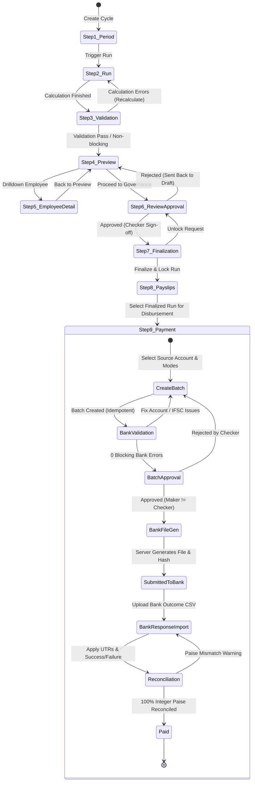

# PAYROLL COMPLETION PLAN — PART 1: PAYMENT/DISBURSEMENT

Generated: 2026-09-24
Based on: Actual repository audit (PAYROLL_AS_IS.md)

---

## 1. Executive Summary

The existing payroll frontend implements Steps 1–8 (Periods → Finalization) with:
- 9 pages, ~6,500 lines of TypeScript/TSX
- Comprehensive `payrollApi.ts` (~3,057 lines) with all Step 1–8 endpoints defined
- **Zero mock data** — all pages handle loading, error (404/401/403), empty, unavailable states
- All backend endpoints currently return **404** (not deployed)
- RBAC uses `payroll.view` / `payroll.process` only; approval/finalize permissions exist only for admin

**Part 1 Goal**: Implement Step 9 — Payment/Disbursement — with frontend architecture ready for backend integration, proper unavailable states where backend doesn't exist, and strict adherence to money safety, idempotency, security, and maker-checker rules.

---

## 2. Reusable Existing Code

| Asset | Location | Reusable For Payment |
|-------|----------|---------------------|
| `payrollApi.ts` types | `src/services/payrollApi.ts:1-1070` | Extend with `PaymentBatch`, `BankAccount`, `BankFile`, `PaymentReconciliation` types |
| Normalization functions | `src/services/payrollApi.ts:754-1842` | Pattern for new payment normalizers |
| Page patterns | `src/pages/Payroll*.tsx` | Wizard modals, tables, skeletons, error banners, permission guards |
| `formatINR()` / `formatCount()` | Each page (local) | Centralize in `src/lib/format.ts` (to create) |
| `maskAccountNumber()` | `PayrollPayslipPage.tsx:96-101` | Reuse for payment batch tables |
| Confirmation dialogs | `PayrollFinalizationPage.tsx:999-1087` | Pattern for irreversible payment actions |
| In-flight guards | `PayrollProcessingPage.tsx:248` (`inFlightRef`) | Pattern for payment mutations |
| Polling pattern | `PayrollProcessingPage.tsx:296-330` | Payment status polling |
| Route lazy loading | `src/routes/dashboard.payroll.*.tsx` | New payment routes |
| `lazyFeaturePage` | `src/lib/lazyFeaturePage.ts` | Payment page lazy loading |

---

## 3. New Files Required

### 3.1 Feature Structure: `src/features/payroll/`

```
src/features/payroll/
├── api/
│   ├── paymentApi.ts           # NEW: Payment/Disbursement API calls
│   ├── paymentSchemas.ts       # NEW: Zod schemas for payment endpoints
│   └── index.ts
├── types/
│   ├── payment.ts              # NEW: PaymentBatch, BankAccount, etc.
│   └── index.ts
├── hooks/
│   ├── usePaymentBatch.ts      # NEW: TanStack Query hooks for payment
│   ├── useBankValidation.ts    # NEW: Bank detail validation hook
│   └── index.ts
├── components/
│   ├── PayrollStepper.tsx      # NEW: Shared 9-step lifecycle component
│   ├── PaymentBatchWizard.tsx  # NEW: Multi-step batch creation
│   ├── BankValidationTable.tsx # NEW: Validation issues table
│   ├── BankAccountMask.tsx     # NEW: Masked account with reveal
│   ├── PaymentReconciliation.tsx # NEW: Reconciliation summary
│   ├── ConfirmDialog.tsx       # NEW: Reusable irreversible action dialog
│   └── index.ts
├── pages/
│   ├── PaymentBatchCreatePage.tsx
│   ├── PaymentBatchListPage.tsx
│   ├── PaymentBatchDetailPage.tsx
│   ├── BankValidationPage.tsx
│   ├── PaymentReconciliationPage.tsx
│   └── index.ts
├── utils/
│   ├── idempotency.ts          # NEW: Idempotency key generation/management
│   ├── csvProtection.ts        # NEW: CSV injection protection
│   ├── money.ts                # NEW: Integer paise utilities
│   └── index.ts
├── constants/
│   ├── paymentStatus.ts        # NEW: Payment status enums
│   ├── paymentModes.ts         # NEW: NEFT/RTGS/IMPS/UPI constants
│   └── index.ts
└── index.ts
```

### 3.2 Routes (TanStack Start)

```
src/routes/
├── dashboard.payroll.payments.tsx                    # /dashboard/payroll/payments (list)
├── dashboard.payroll.payments.$batchId.tsx           # /dashboard/payroll/payments/$batchId (detail)
├── dashboard.payroll.runs.$runId.payment.tsx         # /dashboard/payroll/runs/$runId/payment (create from run)
└── dashboard.payroll.runs.$runId.payment.batch.$batchId.tsx  # nested detail
```

### 3.3 Documentation Updates

| File | Updates |
|------|---------|
| `docs/ROUTE_ACCESS.md` | Add payment routes with permissions |
| `src/lib/route-guards.ts` | Add payment route entries |
| `src/services/sidebarApi.ts` | Add `payroll.approve`, `payroll.finalize`, `payroll.disburse`, `payroll.reports`, `payroll.compensation.view`, `payroll.compensation.edit`, `payroll.statutory` to `DEFAULT_ROLE_PERMISSIONS` |
| `src/lib/format.ts` | **CREATE** — centralize `formatINR`, `formatCount`, `formatDate`, `maskAccountNumber`, `maskIdentifier` |

---

## 4. Dependencies

### 4.1 Internal
- `@/services/payrollApi` — extend, do not modify existing
- `@/components/ui/*` — shadcn/ui components (Dialog, Table, Select, etc.)
- `@/components/hrms/Shared` — GlassCard, StatCard, EmptyState, Skeleton
- `@/lib/aurix-store` — user session, role
- `@/redux/hooks` — `useAppSelector` for permissions
- `@tanstack/react-query` — **NEW**: Use for payment data fetching (recommended over local state)

### 4.2 External (Already in Package.json)
- `zod` — schema validation
- `axios` — via `apiInstance`
- `sonner` — toasts
- `lucide-react` — icons
- `crypto.randomUUID()` — native (idempotency keys)

### 4.3 Backend (Required for Full Functionality)
| Endpoint | Status | Notes |
|----------|--------|-------|
| `POST /api/v2/payroll/runs/{runId}/payment-batches` | PROPOSED | Create batch from finalized run |
| `GET /api/v2/payroll/payment-batches` | PROPOSED | List with filters |
| `GET /api/v2/payroll/payment-batches/{batchId}` | PROPOSED | Batch detail |
| `POST /api/v2/payroll/payment-batches/{batchId}/validate` | PROPOSED | Bank detail validation |
| `POST /api/v2/payroll/payment-batches/{batchId}/approve` | PROPOSED | Maker-checker approval |
| `POST /api/v2/payroll/payment-batches/{batchId}/bank-file` | PROPOSED | Generate bank file |
| `POST /api/v2/payroll/payment-batches/{batchId}/submit` | PROPOSED | Mark submitted to bank |
| `POST /api/v2/payroll/payment-batches/{batchId}/bank-response` | PROPOSED | Import bank CSV |
| `POST /api/v2/payroll/payment-batches/{batchId}/reconcile` | PROPOSED | Reconcile |
| `POST /api/v2/payroll/payment-batches/{batchId}/retry` | PROPOSED | Retry failed |
| `GET /api/v2/payroll/companies/{companyId}/bank-accounts` | PROPOSED | Source accounts |
| `GET /api/v2/payroll/employees/{employeeId}/bank-details` | PROPOSED | Employee bank details |

---

## 5. Security Risks & Mitigations

| Risk | Mitigation |
|------|------------|
| **Full bank account exposure** | Mask by default (`••••••1234`); reveal requires permission + audit + 15s auto-hide |
| **Salary/PAN/Aadhaar in logs** | Never log sensitive fields; sanitize in error boundaries |
| **Double payment submission** | Idempotency-Key per user intent + in-flight guard + button disable |
| **Maker-checker bypass** | Frontend disables Approve for creator; backend MUST enforce |
| **CSV injection in exports** | Prefix `=`, `+`, `-`, `@` with `'` in all CSV cells |
| **Payment amounts tampered** | Frontend NEVER calculates; all amounts from backend as string decimal or integer paise |
| **Blob URL leaks** | Revoke after download (`window.URL.revokeObjectURL()`) |
| **Cache leakage** | `Cache-Control: no-store` on all payment API responses |

---

## 6. Migration Risks

| Risk | Mitigation |
|------|------------|
| **Existing `payrollApi.ts` modification** | **FORBIDDEN** — create new `paymentApi.ts` |
| **Route conflicts** | Use `$runId` and `$batchId` params distinctly |
| **Permission gaps** | Default-deny; add permissions to sidebarApi before routes |
| **TypeScript `any` creep** | Zero `any` in new code; use Zod inference |
| **Money as float** | Use `string` or `bigint` (paise) only; never `number` for money |

---

## 7. Implementation Phases (Part 1 Only)

### Phase 1A: Foundation (Week 1)
- [ ] Create `src/lib/format.ts` with shared formatters
- [ ] Add payment permissions to `sidebarApi.ts` and `route-guards.ts`
- [ ] Create `src/features/payroll/types/payment.ts` with Zod schemas
- [ ] Create `src/features/payroll/api/paymentApi.ts` with all PROPOSED endpoints
- [ ] Create `src/features/payroll/components/PayrollStepper.tsx` with 9 steps
- [ ] Create `src/features/payroll/utils/idempotency.ts`, `money.ts`, `csvProtection.ts`

### Phase 1B: Payment Batch Creation (Week 1-2)
- [ ] `PaymentBatchWizard` component (source account, mode, split, holds, totals)
- [ ] `PaymentBatchCreatePage` at `/dashboard/payroll/runs/$runId/payment`
- [ ] Bank account loading from backend/settings
- [ ] Masking in wizard preview
- [ ] Idempotent create with confirmation dialog

### Phase 1C: Bank Validation (Week 2)
- [ ] `BankValidationTable` component (missing account, invalid IFSC, name mismatch, duplicate, zero/negative net)
- [ ] `BankValidationPage` at `/dashboard/payroll/payments/$batchId/validate`
- [ ] Blocking vs warning severity
- [ ] Fix actions where possible (link to employee detail)

### Phase 1D: Approval & Bank File (Week 2-3)
- [ ] Maker-checker UI: disable Approve for creator with reason
- [ ] Approval modal with audit info (created by/at, approved by/at)
- [ ] Bank file download (backend-generated only)
- [ ] File hash display if backend provides

### Phase 1E: Submit & Bank Response (Week 3)
- [ ] "Mark as Submitted" with idempotency + confirmation
- [ ] CSV upload flow with validation preview
- [ ] Row-level validation: valid/invalid/duplicate/unknown ref/missing UTR/amount mismatch
- [ ] Explicit confirm apply (no partial silent apply)

### Phase 1F: Reconciliation & Status (Week 3)
- [ ] Reconciliation summary: expected = paid + failed + held + processing (integer paise)
- [ ] Payment status tracking: UTR, credited date, failure reason, hold/release
- [ ] Retry failed payment (idempotent)
- [ ] Run status → "Paid" ONLY on backend confirmation

### Phase 1G: Dashboard Integration (Week 3)
- [ ] `PaymentBatchListPage` at `/dashboard/payroll/payments`
- [ ] Update `PayrollDashboardPage` / `PayrollFinalizationPage` with Step 9 link
- [ ] Show overall run status from backend (not hardcoded)

### Phase 1H: Testing & Hardening (Week 4)
- [ ] State machine tests (valid/invalid transitions)
- [ ] Idempotency tests (duplicate create/submit/import/retry)
- [ ] Double-click tests
- [ ] Bank validation tests (IFSC, duplicate, mismatch, zero, negative)
- [ ] Reconciliation tests (match, mismatch, failed, held)
- [ ] Permission tests (view, process, approve, disburse)
- [ ] Maker-checker test (creator cannot approve)
- [ ] Backend unavailable tests (404, 501, network error)
- [ ] Security tests (masking, no sensitive in URL/logs/localStorage/Sentry, Cache-Control, Blob revoke, CSV injection)
- [ ] Accessibility tests (keyboard, axe on key pages)
- [ ] TypeScript build, lint, typecheck pass

---

## 8. Size Estimates

| Component | Size | Notes |
|-----------|------|-------|
| `paymentApi.ts` + schemas | L (~500 lines) | 12 endpoints, Zod schemas, error handling |
| `PayrollStepper` | S (~150 lines) | Shared component |
| `PaymentBatchWizard` | L (~600 lines) | Multi-step form, validation, totals |
| `PaymentBatchCreatePage` | M (~300 lines) | Wizard integration, permissions |
| `BankValidationTable` + Page | M (~400 lines) | Complex table with actions |
| `PaymentBatchListPage` | M (~250 lines) | Standard list pattern |
| `PaymentBatchDetailPage` | M (~350 lines) | Tabs: Overview, Validation, Approval, Bank File, Response, Reconciliation |
| `PaymentReconciliationPage` | M (~300 lines) | Summary cards + detail table |
| Route files | S (~50 lines each) | 4 routes |
| Hooks (TanStack Query) | M (~200 lines) | Queries + mutations |
| Tests | L (~800 lines) | Unit + integration + MSW |
| **Total Part 1** | **~4,000 lines** | New code only |

---

## 9. 9-Step Lifecycle State Machine & Transition Rules

### 9.1 Canonical 9 Steps & Route Mappings
| Step # | Lifecycle Step | Route Pattern | Allowed Roles | Transition Prerequisite |
|--------|---------------|---------------|---------------|--------------------------|
| 1 | **Period** | `/dashboard/payroll/periods` | HR, Admin | Cycle created & open |
| 2 | **Run** | `/dashboard/payroll/runs/$runId/processing` | HR, Admin | Run initiated from period |
| 3 | **Validation** | `/dashboard/payroll/runs/$runId/validation` | HR, Admin | Run calculation completed |
| 4 | **Preview** | `/dashboard/payroll/runs/$runId/preview` | HR, Admin | Validation findings reviewed |
| 5 | **Employee Detail** | `/dashboard/payroll/runs/$runId/employees/$employeeId` | HR, Admin | Drill-down from Preview |
| 6 | **Review & Approval** | `/dashboard/payroll/runs/$runId/approval` | Admin (`payroll.approve`) | 0 blocking validation errors |
| 7 | **Finalization** | `/dashboard/payroll/runs/$runId/finalize` | Admin (`payroll.finalize`) | Approved by authorized checker |
| 8 | **Payslips** | `/dashboard/payroll/payslips` | Employee, HR, Admin | Finalized & locked run |
| 9 | **Payment** | `/dashboard/payroll/runs/$runId/payment` | Admin (`payroll.disburse`) | Finalized run + source account |

### 9.2 Mermaid State Machine Diagram



### 9.3 Valid Transitions
| From | To | Condition |
|------|-----|-----------|
| Period | Run | Cycle active and open |
| Run | Validation | Background calculation complete |
| Validation | Preview | Zero blocking rule errors |
| Preview | EmployeeDetail | Employee record clicked |
| EmployeeDetail | Preview | Return to summary table |
| Preview | Review & Approval | Preview verified by HR maker |
| Review & Approval | Finalization | Checker sign-off completed |
| Finalization | Payslips | Run finalized and cryptographically locked |
| Payslips | Payment | Finalized run passed to disbursement engine |
| CreateBatch | BankValidation | Batch record created with Idempotency-Key |
| BankValidation | BatchApproval | Zero blocking bank/IFSC errors |
| BatchApproval | BankFileGen | Checker != Maker sign-off |
| BankFileGen | Submitted | Bank file downloaded, uploaded to bank portal |
| Submitted | BankResponse | Bank disbursement report received |
| BankResponse | Reconciliation | Row-level UTR & status applied |
| Reconciliation | Paid | Expected paise == (paid + failed + held + processing) |

### 9.4 Invalid Transitions (Blocked by Frontend + Backend)
| From | To | Reason |
|------|-----|--------|
| Draft / Open | Payment | Cannot disburse un-finalized run |
| Validation | Review & Approval | Unresolved blocking validation errors |
| Review & Approval | Review & Approval | Creator cannot approve their own run (maker-checker) |
| CreateBatch | BatchApproval | Bank validation not executed |
| BatchApproval | BatchApproval | Creator cannot approve their own payment batch (maker-checker) |
| Submitted | Submitted | Duplicate submission blocked via idempotency key |
| Reconciliation | Paid | Mathematical paise discrepancy (mismatch != 0) |
| Any | Paid | Frontend cannot locally force status to Paid |

---
---

## 10. Definition of Done (Part 1)

- [ ] All new files created under `src/features/payroll/`
- [ ] TypeScript compiles with **zero errors**, **zero new `any`**
- [ ] `npm run lint` passes
- [ ] `npm run build` passes
- [ ] Unit tests pass (state machine, idempotency, validation, reconciliation, permissions, maker-checker)
- [ ] MSW tests pass for 404/501/403/401/network error
- [ ] Money edge cases tested: 0, negative, lakh, crore, 2 decimals
- [ ] Security verified: masking, no sensitive logs/URL/localStorage/Sentry, Cache-Control, Blob revoke, CSV injection protection
- [ ] Accessibility: keyboard walkthrough, axe on PaymentBatchCreatePage, PaymentBatchDetailPage, BankValidationPage
- [ ] Documentation updated: PAYROLL_AS_IS.md, PAYROLL_COMPLETION_PLAN.md, PAYROLL_BACKEND_CONTRACT.md, PAYROLL_BACKEND_TODO.md, ROUTE_ACCESS.md
- [ ] Backend TODO list documented with all PROPOSED endpoints

---

## 11. Out of Scope (Later Parts)

| Feature | Part |
|---------|------|
| Payroll Reports (cost center, department, tax) | Part 2 |
| Salary Structure Builder | Part 2 |
| Variable Inputs (bonus, overtime, arrears) | Part 2 |
| Statutory Compliance (PF/ESI/PT/TDS returns) | Part 3 |
| Full & Final Settlement Integration | Part 3 |
| Employee Self-Service (payslip history, tax declaration) | Part 4 |
| Hardening (audit logs, notifications, webhooks) | Part 4 |