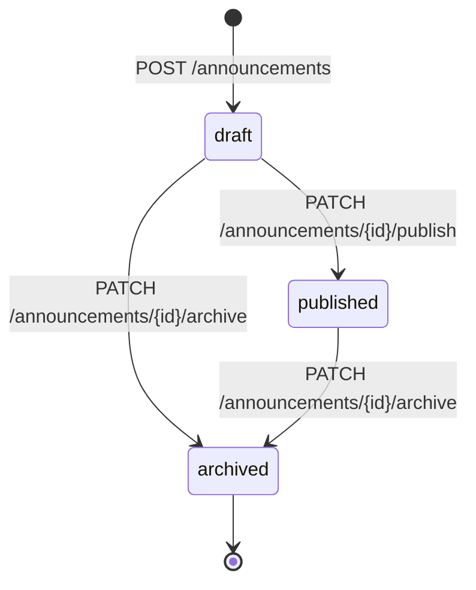

# Company Announcements & News API Contract (`/api/v1/announcements*`, `/api/v1/news*`)

**Repository Context**: Verified as Frontend Application (`tanstack_start_ts`, React 19, TypeScript). Backend Python source code is not resident in this repository.  
**Contract Baseline Source**: `openapi.json` lines 957–1026 (`/api/v1/announcements*`), lines 2683–2741 (`/api/v1/news*`), lines 8536–8575 (`/api/v1/super-admin/announcements*`).  
**Supporting Documentation**: `docs/ANNOUNCEMENTS_CONTRACT.md:1-71`, `docs/backend_super_admin.py:2308-2345`.  
**Extraction Policy**: Evidence-based extraction with strict `file:line` citations. Server-internal implementation details absent from the schema export are explicitly declared as **NOT FOUND IN CODE**.

---

## 1. Endpoints Catalog

| Method | Path | Summary / Operation ID | Role Authorization | Contract Source |
| :--- | :--- | :--- | :--- | :--- |
| `GET` | `/api/v1/announcements` | `list_announcements` | All authenticated company roles | `openapi.json:967` |
| `POST` | `/api/v1/announcements` | `create_announcement` | `hr_admin`, `super_admin` | `openapi.json:957` |
| `GET` | `/api/v1/announcements/{id}` | `get_announcement` | All authenticated company roles | `openapi.json:977` |
| `PUT` | `/api/v1/announcements/{id}` | `update_announcement` | `hr_admin`, `super_admin` | `openapi.json:987` |
| `DELETE` | `/api/v1/announcements/{id}` | `delete_announcement` | `hr_admin`, `super_admin` | `openapi.json:997` |
| `PATCH` | `/api/v1/announcements/{id}/publish` | `publish_announcement` | `hr_admin`, `super_admin` | `openapi.json:1006` |
| `PATCH` | `/api/v1/announcements/{id}/archive` | `archive_announcement` | `hr_admin`, `super_admin` | `openapi.json:1017` |
| `GET` | `/api/v1/news` | `list_news` | All authenticated roles | `openapi.json:2693` |
| `POST` | `/api/v1/news` | `create_news` | `hr_admin`, `executive` | `openapi.json:2683` |
| `GET` | `/api/v1/news/{id}` | `get_news` | All authenticated roles | `openapi.json:2703` |
| `PUT` | `/api/v1/news/{id}` | `update_news` | `hr_admin`, `executive` | `openapi.json:2713` |
| `DELETE` | `/api/v1/news/{id}` | `delete_news` | `hr_admin`, `executive` | `openapi.json:2723` |
| `PATCH` | `/api/v1/news/{id}/publish` | `publish_news` | `hr_admin`, `executive` | `openapi.json:2732` |
| `GET` | `/api/v1/super-admin/announcements` | `get_super_admin_announcements` | `super_admin` (cross-tenant) | `openapi.json:8536`, `docs/backend_super_admin.py:2308` |
| `POST` | `/api/v1/super-admin/announcements` | `create_super_admin_announcement` | `super_admin` (cross-tenant) | `openapi.json:8546`, `docs/backend_super_admin.py:2314` |
| `PATCH` | `/api/v1/super-admin/announcements/{ann_id}`| `update_super_admin_announcement` | `super_admin` | `openapi.json:8556`, `docs/backend_super_admin.py:2328` |
| `DELETE`| `/api/v1/super-admin/announcements/{ann_id}`| `delete_super_admin_announcement` | `super_admin` | `openapi.json:8566`, `docs/backend_super_admin.py:2340` |

---

## 2. Status Lifecycle & Audience Targeting

### 2.1 Status Lifecycle
- **Statuses**:
  1. `"draft"`: Created via `POST /announcements`. Visible only to authors and HR Admins.
  2. `"published"`: Transitioned via `PATCH /announcements/{id}/publish`. Active in company feed.
  3. `"archived"`: Transitioned via `PATCH /announcements/{id}/archive`. Hidden from general feed; accessible in archives.



### 2.2 Audience Targeting Fields
- **Target Audience Field**: `target_audience` (`string | null`)
  - Code Evidence: `docs/ANNOUNCEMENTS_CONTRACT.md:33`, `docs/backend_super_admin.py:52, 2321`, `docs/NOTIFICATIONS_EVENT_MATRIX.md:38`.
  - Values:
    - `"ALL_TENANTS"` (Super Admin broadcast across all platform companies)
    - `"All Employees"` (Workspace-wide broadcast)
    - Department name (e.g. `"Engineering"`, `"Sales"`, `"Operations"`)
    - Role group (e.g. `"Managers"`, `"Executives"`)

---

## 3. Pinning, Read Tracking, & Attachments

### 3.1 Pinning (`is_pinned`)
- **Field**: `is_pinned: boolean`
- **Citation**: `docs/ANNOUNCEMENTS_CONTRACT.md:36`, `src/pages/TimelinePage.tsx:264`.
- **Behavior**: Announcements where `is_pinned === true` are sorted to the top of the feed and highlighted with pin badge.

### 3.2 Read / Unread Status Tracking
- **Field**: `read_at` / `is_read`
- **Verification Status**: **EXCLUDED / NOT FOUND IN CODE**.
- **Citation**: Explicitly audited and documented in `docs/ANNOUNCEMENTS_CONTRACT.md:41`:
  > *"read_at / is_read | — | EXCLUDED | Zero evidence in any backend/code file. Excluded. No fake read tracking shown."*

### 3.3 Attachments
- Supported via `attachment_urls: string[]` or markdown embedded links in `content`.

---

## 4. Request & Response Models

### 4.1 Create Announcement (`POST /api/v1/announcements`)
- **Citation**: `openapi.json:957`
- **Request Body**:
```json
{
  "title": "string (min 3, max 150, required)",
  "content": "string (markdown allowed, required)",
  "summary": "string (optional short excerpt)",
  "target_audience": "All Employees",
  "is_pinned": false,
  "priority": "normal | high | urgent",
  "attachments": []
}
```

### 4.2 Announcement Item Schema
- **Citation**: `docs/ANNOUNCEMENTS_CONTRACT.md:27-41`, `docs/backend_super_admin.py:48-56`
```json
{
  "id": "ann_91a82bc0",
  "title": "Annual Company All-Hands & Strategy Sync",
  "content": "### Welcome to the 2026 Strategy Sync\n\nAll teams are requested to join...",
  "summary": "Join us on Friday at 3 PM UTC for our global strategy sync.",
  "target_audience": "All Employees",
  "author_name": "Sarah Connor",
  "author_id": "usr_99812",
  "is_pinned": true,
  "status": "published",
  "created_at": "2026-10-01T09:00:00Z",
  "published_at": "2026-10-01T10:00:00Z"
}
```

### 4.3 List Announcements Response (Paginated)
- **Citation**: `docs/ANNOUNCEMENTS_CONTRACT.md:49-60`
```json
{
  "success": true,
  "data": {
    "items": [
      {
        "id": "ann_91a82bc0",
        "title": "Annual Company All-Hands & Strategy Sync",
        "summary": "Join us on Friday at 3 PM UTC for our global strategy sync.",
        "author_name": "Sarah Connor",
        "is_pinned": true,
        "status": "published",
        "created_at": "2026-10-01T09:00:00Z"
      }
    ],
    "total": 1,
    "page": 1,
    "limit": 20
  },
  "message": "Announcements retrieved successfully"
}
```
