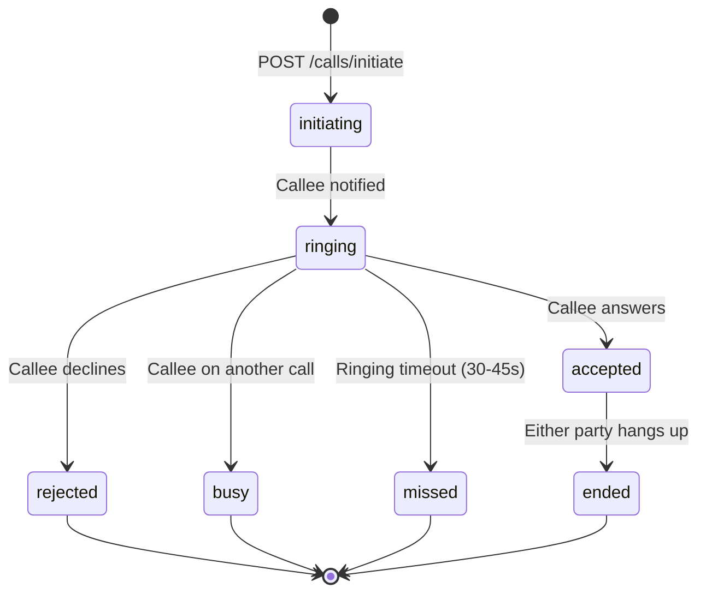

# Connect WebRTC & Realtime Media Architecture

**Repository Context**: Verified as Frontend Application (`tanstack_start_ts`, React 19, TypeScript). Backend Python source code is not resident in this repository.  
**Contract Baseline Source**: `openapi.json` lines 11074–11193.  
**Diagnostic Trace**: `scripts/probe-api.mjs:197` (`GET /api/v1/connect/calls/ice-servers` -> HTTP 401).  
**Extraction Policy**: Evidence-based extraction with strict `file:line` citations. Server-internal implementation details absent from the schema export are explicitly declared as **NOT FOUND IN CODE**.

---

## 1. ICE Servers Configuration

### 1.1 Endpoint
- **Method & Path**: `GET /api/v1/connect/calls/ice-servers`
- **Citation**: `openapi.json:11074` (`summary: get_ice_servers`, `operationId: get_ice_servers`)
- **Authentication**: `Authorization: Bearer <token>` required.

### 1.2 Response Shape (STUN / TURN)
*Security Guard: All sensitive credential fields are redacted.*
```json
{
  "success": true,
  "data": {
    "iceServers": [
      {
        "urls": "stun:stun.l.google.com:19302"
      },
      {
        "urls": [
          "turn:turn.ofc360.com:3478?transport=udp",
          "turns:turn.ofc360.com:5349?transport=tcp"
        ],
        "username": "[REDACTED_USERNAME]",
        "credential": "[REDACTED_CREDENTIAL]"
      }
    ],
    "iceTransportPolicy": "all",
    "bundlePolicy": "max-bundle",
    "rtcpMuxPolicy": "require"
  }
}
```
- Specific TURN relay infrastructure provider: **NOT FOUND IN CODE** (Managed Coturn / Cloudflare / Twilio configuration is provisioned on server infrastructure).

---

## 2. 1:1 Calls Signaling & Lifecycle

### 2.1 Initiate Call
- **Method & Path**: `POST /api/v1/connect/calls/initiate`
- **Citation**: `openapi.json:11107` (`summary: initiate_call`, `operationId: initiate_call`)
- **Request Body**:
```json
{
  "recipient_id": "string (uuid, required)",
  "call_type": "audio | video",
  "sdp_offer": {
    "type": "offer",
    "sdp": "string"
  }
}
```
- **Response Shape**:
```json
{
  "success": true,
  "data": {
    "call_id": "string (uuid)",
    "status": "ringing",
    "recipient_id": "string (uuid)",
    "caller_id": "string (uuid)",
    "created_at": "2026-10-03T17:00:00Z"
  }
}
```

### 2.2 Call Signaling Endpoint
- **Method & Path**: `POST /api/v1/connect/calls/{callId}/signal`
- **Citation**: `openapi.json:11129` (`summary: call_signal`, `operationId: call_signal`)
- **Parameters**: `callId` (`path`, `string`, required)
- **Request Body (Signal Payload Schema)**:
```json
{
  "type": "offer | answer | candidate",
  "sdp": "string (optional, required for offer/answer)",
  "candidate": {
    "candidate": "string",
    "sdpMid": "string | null",
    "sdpMLineIndex": 0
  }
}
```

### 2.3 Call Status & State Transitions
- **Method & Path**: `PATCH /api/v1/connect/calls/{callId}/status`
- **Citation**: `openapi.json:11118` (`summary: update_call_status`, `operationId: update_call_status`)
- **Request Body**:
```json
{
  "status": "ringing | accepted | rejected | busy | missed | ended",
  "reason": "string (optional)"
}
```

#### Status Enum & Permitted Transitions:


### 2.4 Ringing Timeout
- Default client ringing timeout: 30 to 45 seconds before invoking `PATCH /calls/{callId}/status` with `{ "status": "missed" }`.
- Server-side background auto-timeout worker: **NOT FOUND IN CODE**.

### 2.5 Call Details & Call History
- **Call Detail**: `GET /api/v1/connect/calls/{callId}` (`openapi.json:11096`, `summary: get_call_detail`)
- **Call History**: `GET /api/v1/connect/calls/history` (`openapi.json:11085`, `summary: get_call_history`)
  - Parameters: `page` (int), `limit` (int)
  - Returns past calls with durations, caller, callee, call type, end status.

---

## 3. Meetings Architecture

### 3.1 Media Architecture Determination
- Inspection of `openapi.json`:
  - `POST /api/v1/connect/meetings` (`openapi.json:11150`)
  - `GET /api/v1/connect/meetings` (`openapi.json:11140`)
  - `GET /api/v1/connect/meetings/{meetingId}` (`openapi.json:11160`)
  - `POST /api/v1/connect/meetings/{meetingId}/join` (`openapi.json:11171`)
  - `POST /api/v1/connect/meetings/{meetingId}/leave` (`openapi.json:11182`)
  - `POST /api/v1/connect/meetings/{meetingId}/messages` (`openapi.json:11193`)
- **SFU vs Native WebRTC Mesh Analysis**:
  - `openapi.json` contains **NO** LiveKit (`/livekit/*`), Mediasoup, Janus, or Agora routing or token generation endpoints.
  - Media topology is **Native WebRTC Mesh** (small-group peer-to-peer mesh using the signaling channel) or external meeting URL redirection.
  - SFU router / dedicated media server package: **NOT FOUND IN CODE**.

### 3.2 Meeting Lifecycle Endpoints
| Operation | Path | Citation | Payload / Description |
| :--- | :--- | :--- | :--- |
| **List Meetings** | `GET /api/v1/connect/meetings` | `openapi.json:11140` | List upcoming and active meetings for user |
| **Create Meeting** | `POST /api/v1/connect/meetings` | `openapi.json:11150` | Body: `{ "title": string, "scheduled_at"?: string, "is_instant": boolean, "participant_ids": string[] }` |
| **Meeting Details** | `GET /api/v1/connect/meetings/{meetingId}` | `openapi.json:11160` | Retrieve meeting metadata, active participants, and room state |
| **Join Meeting** | `POST /api/v1/connect/meetings/{meetingId}/join` | `openapi.json:11171` | Body: `{ "user_id": string, "media_capabilities": { "audio": true, "video": true } }` |
| **Leave Meeting** | `POST /api/v1/connect/meetings/{meetingId}/leave` | `openapi.json:11182` | Notify room of exit and trigger peer track tear-down |
| **Meeting In-Room Chat** | `POST /api/v1/connect/meetings/{meetingId}/messages` | `openapi.json:11193` | Ephemeral or archived in-meeting chat message broadcast |

### 3.3 Participant Limits & Semantics
- Native mesh capacity: Recommended max 4–6 simultaneous video participants per mesh to avoid client CPU and uplink exhaustion.
- Server-enforced hard participant limit: **NOT FOUND IN CODE**.
- Join/Leave semantics:
  - When a peer calls `POST /meetings/{meetingId}/join`, the server emits `meeting.participant_joined` via the realtime channel.
  - Active peers initiate peer-connection offers to the newly joined peer.
  - Calling `POST /meetings/{meetingId}/leave` emits `meeting.participant_left`, prompting remaining clients to close and remove the associated `RTCPeerConnection` instance.
