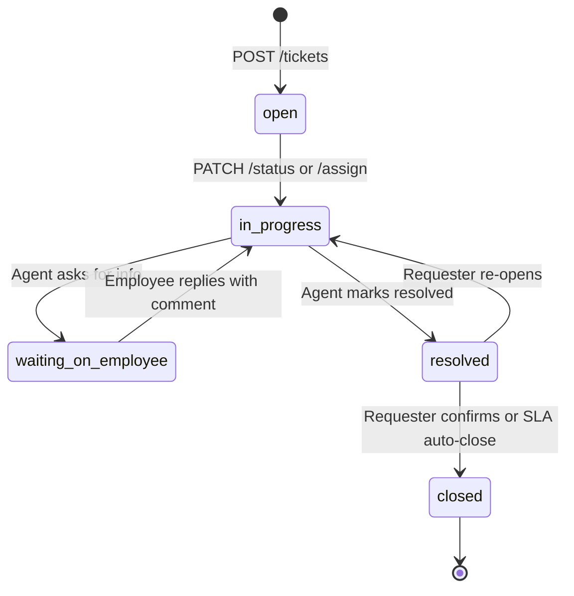

# Helpdesk Service API Contract & Shapes (`/api/v1/helpdesk/*`)

**Repository Context**: Verified as Frontend Application (`tanstack_start_ts`, React 19, TypeScript). Backend Python source code is not resident in this repository.  
**Contract Baseline Source**: `openapi.json` lines 11333–11474, static mount line 19449 (`/uploads/helpdesk`).  
**Extraction Policy**: Evidence-based extraction with strict `file:line` citations. Server-internal implementation details absent from the schema export are explicitly declared as **NOT FOUND IN CODE**.

---

## 1. Endpoints Catalog & Method Matrix

| Method | Path | Summary / Operation ID | Target Audience / Roles | Contract Source |
| :--- | :--- | :--- | :--- | :--- |
| `GET` | `/api/v1/helpdesk/tickets/my` | `get_my_support_tickets` | Requester (all authenticated employees) | `openapi.json:11333` |
| `POST` | `/api/v1/helpdesk/tickets` | `create_support_ticket` | All authenticated employees | `openapi.json:11344` |
| `GET` | `/api/v1/helpdesk/tickets/{ticketId}` | `get_ticket_by_id` | Ticket Requester, Assigned Agent, Admins | `openapi.json:11355` |
| `GET` | `/api/v1/helpdesk/tickets/{ticketId}/comments` | `get_ticket_comments` | Ticket Requester, Assigned Agent, Admins | `openapi.json:11366` |
| `POST` | `/api/v1/helpdesk/tickets/{ticketId}/comments` | `add_ticket_comment` | Ticket Requester, Assigned Agent, Admins | `openapi.json:11376` |
| `POST` | `/api/v1/helpdesk/tickets/attachments/upload` | `upload_ticket_attachment` | Ticket Requester, Agents | `openapi.json:11386` |
| `GET` | `/api/v1/helpdesk/admin/tickets` | `get_all_helpdesk_tickets` | Helpdesk Agents (`it_admin`, `hr_admin`, `super_admin`) | `openapi.json:11397` |
| `PATCH` | `/api/v1/helpdesk/tickets/{ticketId}/status` | `update_ticket_status` | Helpdesk Agents & Ticket Requester (closure) | `openapi.json:11408` |
| `PATCH` | `/api/v1/helpdesk/tickets/{ticketId}/assign` | `assign_ticket_agent` | Helpdesk Dispatchers & Admins | `openapi.json:11419` |
| `POST` | `/api/v1/helpdesk/tickets/{ticketId}/internal-notes` | `add_internal_ticket_note` | Helpdesk Agents ONLY (hidden from employee) | `openapi.json:11430` |
| `GET` | `/api/v1/helpdesk/faqs` | `get_helpdesk_faqs` | All employees | `openapi.json:11441` |
| `POST` | `/api/v1/helpdesk/admin/faqs` | `upsert_helpdesk_faq` | Helpdesk Admins (`it_admin`, `hr_admin`) | `openapi.json:11452` |
| `POST` | `/api/v1/helpdesk/ai/chat` | `execute_support_ai_chat` | All employees | `openapi.json:11463` |
| `GET` | `/api/v1/helpdesk/admin/metrics` | `get_helpdesk_sla_metrics` | Helpdesk Admins & Executives | `openapi.json:11474` |
| `STATIC`| `/uploads/helpdesk` | Static file mount | Authorized download endpoint | `openapi.json:19449` |

---

## 2. Enums & Allowed Status Transitions

### 2.1 Enums
- **Status Enum**:
  - `"open"` (newly submitted, awaiting triage)
  - `"in_progress"` (assigned and currently under investigation)
  - `"waiting_on_employee"` (agent requested additional information or screenshots)
  - `"resolved"` (solution provided by agent)
  - `"closed"` (confirmed resolution / auto-closed)
- **Priority Enum**:
  - `"low"`, `"medium"`, `"high"`, `"urgent"`
- **Category Enum**:
  - `"it_hardware"` (e.g. laptop failure, MDM, monitor, peripherals)
  - `"it_software"` (e.g. SaaS access, IDE license, VPN, credentials)
  - `"hr_policy"` (e.g. benefits, leave disputes, contract details)
  - `"payroll"` (e.g. payslip discrepancy, tax declaration)
  - `"facilities"` (e.g. access badge, desk allocation)
  - `"other"`

### 2.2 Status Lifecycle Diagram

*(Specific backend state machine class in Python: **NOT FOUND IN CODE**)*

---

## 3. Helpdesk Roles & Access Scopes

### 3.1 Who Qualifies as an "Agent"?
In the OFC360 RBAC architecture:
1. `it_admin`: Full triage, assignment, and internal notes for IT categories (`it_hardware`, `it_software`, `facilities`).
2. `hr_admin`: Triage and internal notes for HR categories (`hr_policy`, `payroll`).
3. `super_admin`: Global access across all departments and tickets.
4. Regular `employee` / `manager`: Can **only** view tickets where `requester_id == current_user.id` via `GET /api/v1/helpdesk/tickets/my` (`openapi.json:11333`).

### 3.2 Internal Notes Visibility Rule
- Endpoint: `POST /api/v1/helpdesk/tickets/{ticketId}/internal-notes` (`openapi.json:11430`)
- **Access Rule**: Internal notes are **strictly restricted** to agents and administrators. They are completely filtered out and stripped when regular employees query `GET /api/v1/helpdesk/tickets/{ticketId}` or `GET /comments`.

---

## 4. Request & Response Models

### 4.1 Create Ticket (`POST /api/v1/helpdesk/tickets`)
- **Citation**: `openapi.json:11344`
- **Request Body**:
```json
{
  "title": "string (min 5, max 150, required)",
  "description": "string (required)",
  "category": "it_hardware | it_software | hr_policy | payroll | facilities | other",
  "priority": "low | medium | high | urgent",
  "attachment_urls": ["string (optional)"],
  "related_asset_id": "string (uuid, optional)"
}
```
- **Response Shape (`data`)**:
```json
{
  "id": "string (uuid)",
  "ticket_number": "HD-1042",
  "title": "string",
  "category": "it_hardware",
  "priority": "high",
  "status": "open",
  "requester_id": "string (uuid)",
  "requester_name": "string",
  "assigned_agent_id": null,
  "created_at": "2026-10-03T17:00:00Z",
  "updated_at": "2026-10-03T17:00:00Z"
}
```

### 4.2 Ticket Comments (`GET / POST .../comments`)
- **Get Comments**: `GET /api/v1/helpdesk/tickets/{ticketId}/comments` (`openapi.json:11366`)
- **Add Comment**: `POST /api/v1/helpdesk/tickets/{ticketId}/comments` (`openapi.json:11376`)
  - Request Body: `{ "content": "string (required)", "attachments"?: ["string"] }`

### 4.3 Assign Agent (`PATCH .../assign`)
- **Citation**: `openapi.json:11419`
- **Request Body**: `{ "agent_id": "string (uuid, required)" }`

### 4.4 Internal Note (`POST .../internal-notes`)
- **Citation**: `openapi.json:11430`
- **Request Body**: `{ "note": "string (required)", "mentions"?: ["string (user_id)"] }`

---

## 5. Attachment Uploads & Static Serving

- **Upload Endpoint**: `POST /api/v1/helpdesk/tickets/attachments/upload` (`openapi.json:11386`)
- **Payload Format**: `multipart/form-data` with form field `file`.
- **Static Download Mapping**: Served directly from the backend static mount at `/uploads/helpdesk` (`openapi.json:19449`).
- **Download URL Format**:
  `${API_BASE_URL}/uploads/helpdesk/{stored_filename}`
- Maximum file size limit & allowed MIME types: **NOT FOUND IN CODE** (Backend Python file validation decorator not present in repository).

---

## 6. Helpdesk SLA Metrics (`GET /api/v1/helpdesk/admin/metrics`)
- **Citation**: `openapi.json:11474`
- **Response Shape (`data`)**:
```json
{
  "total_tickets": 150,
  "open_tickets": 24,
  "in_progress_tickets": 12,
  "resolved_tickets": 110,
  "sla_compliance_percentage": 94.5,
  "avg_first_response_time_minutes": 28.4,
  "avg_resolution_time_hours": 4.2,
  "by_category": {
    "it_hardware": 45,
    "it_software": 60,
    "hr_policy": 25,
    "payroll": 15,
    "facilities": 5
  },
  "by_priority": {
    "urgent": 8,
    "high": 32,
    "medium": 75,
    "low": 35
  }
}
```

---

## 7. AI Support Chat (`POST /api/v1/helpdesk/ai/chat`)
- **Citation**: `openapi.json:11463`
- **Request Body**:
```json
{
  "query": "string (required)",
  "conversation_history": [
    {
      "role": "user | assistant",
      "content": "string"
    }
  ]
}
```
- **Response Shape (`data`)**:
```json
{
  "response": "string (markdown formatted)",
  "suggested_faqs": [
    {
      "id": "string",
      "question": "string"
    }
  ],
  "can_auto_resolve": false,
  "suggested_ticket_draft": {
    "category": "it_software",
    "title": "VPN connection failure",
    "priority": "medium"
  }
}
```
